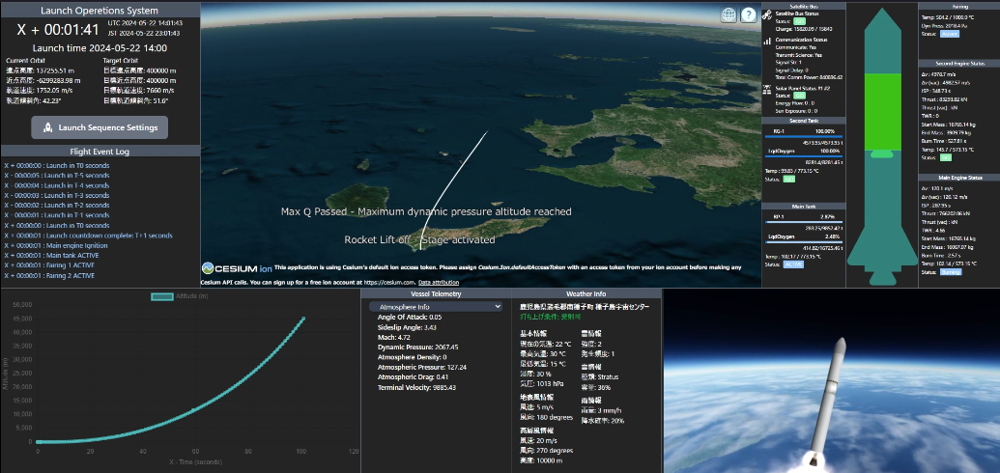
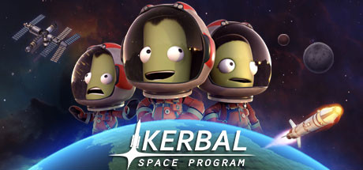
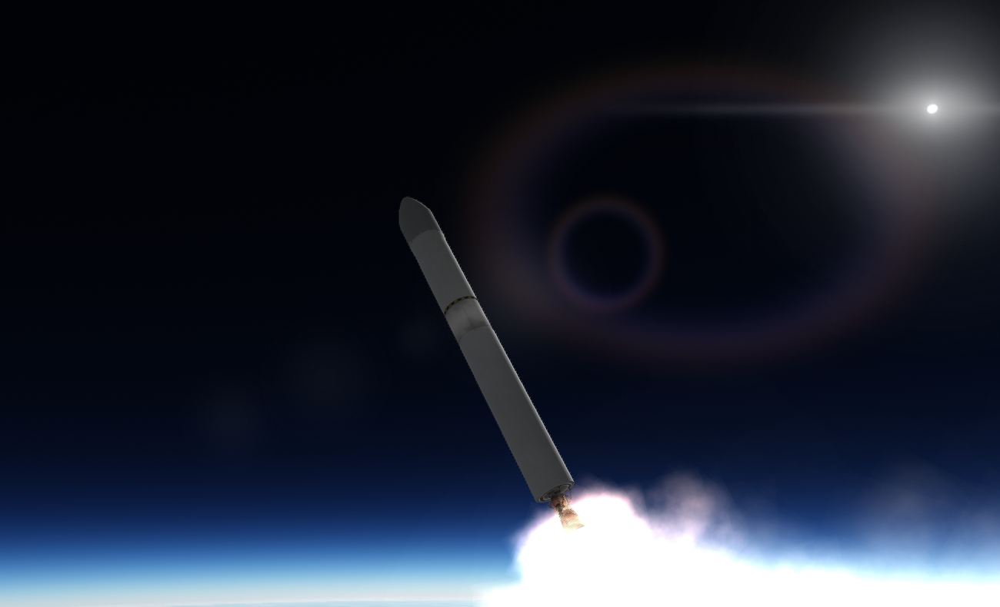
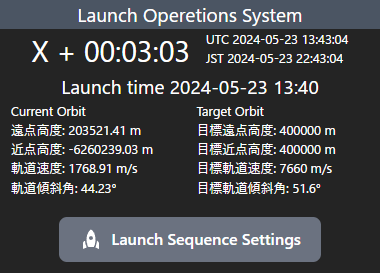
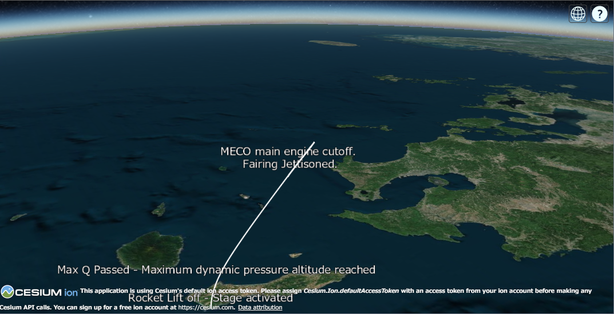
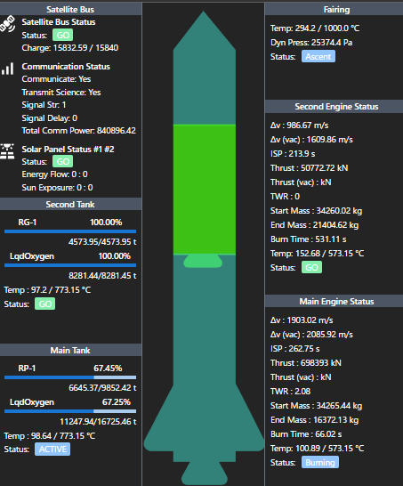
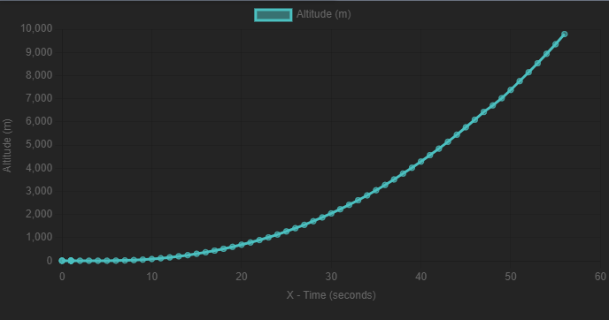
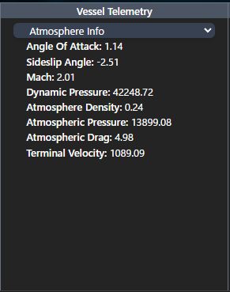
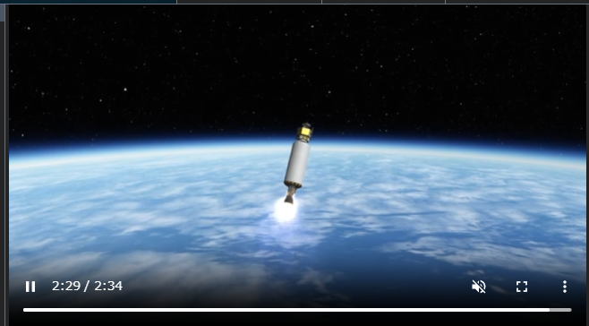
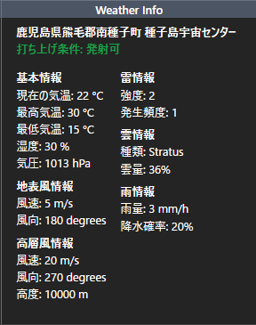

# LaunchOperationsSystem

### 概要
このアプリケーションは、KSP（カーバルスペースプログラム）というシミュレーションゲームと連携して、ロケット管制システムを作ってみよう！という試みです。  
※このシステムで使用するゲームは処理負荷の高いMODを多数使用して実際の地球と同じ環境を再現しています。
そのため、通常スペックのノートPCでは動作が難しい場合がありますのでご注意ください。

打ち上げの様子は以下の動画で確認できます。  
[打ち上げ動画](https://www.youtube.com/)

国際宇宙ステーションの軌道を目指して打ち上げています。  
**目標高度**：400km  
**目標軌道傾斜角**：51.6°  
**打ち上げ場所**：種子島宇宙センター

 

# カーバルスペースプログラムのご紹介

## カーバルスペースプログラムとは？
カーバルスペースプログラム（KSP）は、プレイヤーが自分でロケットを設計し、宇宙へ飛ばすシミュレーションゲームです。

リアルな物理エンジンを使用して、軌道計画や飛行計算を行うことができます。通常、KSPの舞台は地球や太陽系とは異なる架空の惑星系ですが、Mod（モッド）を導入することで、地球と同じ環境を再現することができます。

[カーバルスペースプログラム wiki](https://ja.wikipedia.org/wiki/Kerbal_Space_Program)

 

# ロケット情報

### 機体スペック
- **機体名**: Foward1.7
- **機体高さ**: 21.9m
- **機体全長**: 2.1m
- **機体直径**: 2.1m
- **重量**: 43.099t (ペイロードを除く)
- **乾燥重量**: 16.218トン
- **燃料重量**: 26.881トン
- **運搬能力**: 430kg (高度400km、軌道傾斜角51.6°を目指した場合)

### メインエンジン
- **エンジン名**: LR79エンジン
- **製造国**: 米国
- **エンジンサイクル**: ガス発生器サイクル (Gas Generator Cycle)
- **推進剤**: 液体酸素（Lox）/ケロシン（RG-1）
- **推力(真空)**: 766.340 kN
- **推力**: 659.9 kN

### セカンドエンジン
- **エンジン名**: RD-58
- **製造国**: ロシア
- **エンジンサイクル**: ステージ燃焼サイクル (Staged Combustion Cycle)
- **推進剤**: 液体酸素 (LOX) / ケロシン (RP-1)
- **推力(真空)**: 83.360 kN
- **推力**: 32.2 kN

### 燃料タンク
- **材質**: アルミニウム-リチウム合金 (AL-Li)

 

# 画面機能の紹介

### 目標軌道の設定や現在の軌道情報を表示するコンポーネント
    
このコンポーネントでは、目標軌道の設定や現在の軌道情報を表示します。また、APIのログも表示されます。

### 飛行中のログを表示するコンポーネント

飛行中のログをリアルタイムで表示します。

### Cesiumを使用した飛行軌道表示コンポーネント

Cesiumという地形ライブラリを使用してロケットの飛行軌道を表示します。MECO（Main Engine Cut Off）などの主要イベントが発生した地点でログが記録されます。

### ロケットのステータスを表示するコンポーネント

ロケットの各パーツのステータスをビジュアル的に確認できます。Wait、GO、Active、Cutoffの状態を表示し、現在の温度や燃料の残量なども確認できます。

### 高度の上昇率をグラフに表示するコンポーネント

高度の上昇率をグラフで表示します。現在は高度のみですが、将来的には燃料、推力、大気抵抗などのグラフに切り替えられる予定です。

### ロケットのテレメトリー表示コンポーネント
  
ロケットのテレメトリーを表示するコンポーネントです。軌道情報、デルタV、機体情報、大気情報などを表示します。

### ライブ映像表示コンポーネント
  
OBSから画面をキャプチャし、Node Media Serverでffmpegに変換してブラウザでライブ映像を表示します。3~4秒ほどの遅延があります。

### 気象情報表示コンポーネント
  
気象情報を表示するコンポーネントです。高層風のデータが無料で提供されていないため、仮のデータを使用しています。打ち上げ可否については[JAXAの打ち上げ主要制約条件](https://www.jaxa.jp/countdown/h2bf1/overview/condition_j.html#:~:text=%E7%99%BA%E5%B0%84%E5%89%8D%E5%8F%8A%E3%81%B3%E9%A3%9B%E8%A1%8C%E4%B8%AD,%E7%99%BA%E5%B0%84%E3%82%92%E8%A1%8C%E3%82%8F%E3%81%AA%E3%81%84%E3%81%93%E3%81%A8%E3%80%82)を参考にしています。

 

# 開発・実行環境
## 1. ハードウェアスペック
- **OS**: Windows 11
- **CPU**: AMD Ryzen 7 5700X
- **GPU**: MSI GeForce RTX 4060 Ti 8GB
- **メモリ**: DDR4 64GB（16GB x 4）
- **ストレージ**: KIOXIA SSD 1TB NVMe M.2 Type 2280 PCIe

## 2. ソフトウェアスタック

### API
- **言語**: Python 3.12.1
- **フレームワーク**: FastAPI 0.111.0
- **ライブラリ管理**: Poetry
- **Linting**: Ruff
- **フォーマッティング**: Ruff
- **主なライブラリ**:
    - `krpc`: KSPのkrpc modに接続するためのPython SDK

### フロントエンド
- **言語**: TypeScript
- **フレームワーク**: React
- **ビルドツール**: Vite
- **Linting**: Eslint
- **フォーマッティング**: Prettier
- **主なライブラリ**:
  - `cesium`: 地形ライブラリ
  - `resium`:
  - `chart.js`: グラフを表示する
  - `react-player`: ライブ映像をブラウザで表示する
  - `tailwindcss`: CSSフレームワーク
  - `mui`: マテリアルUIを使用したコンポーネントライブラリ

### ライブサーバー
- **言語**: JavaScript
- **ランタイム**: Node.js v20.12.0
- **主なライブラリ**:
  - `@ffmpeg-installer/ffmpeg`: データを変換する
  - `node-media-server`: OBSからのストリーム映像を処理する

## 3. 開発ツール
- **IDE**: Visual Studio Code
- **バージョン管理**: Git

## 4. KSPで使用した全MOD
1. **FerramAerospaceResearch**: 空力モデルをリアルにする
2. **000_Harmony**: MOD間の互換性を高めるためのライブラリ
3. **000_KSPBurst**: 高性能なコード実行を可能にするライブラリ
4. **000_TexturesUnlimited**: 高品質なテクスチャのロードをサポートする
5. **000_Toolbar**: ユーザーインターフェイスにカスタムツールバーを追加する
6. **001_ToolbarControl**: カスタムツールバーの管理をサポートする
7. **999_Scale_Redist.dll**: パーツのスケールを変更するためのライブラリ
8. **AJE**: エンジンの物理シミュレーションを改善する
9. **AtmosphereAutopilot**: 自動操縦機能を強化する
10. **B9_Aerospace_ProceduralWings**: 可変形翼を追加する
11. **BahaSP**: 特殊パーツを追加する
12. **CommunityResourcePack**: 共有リソースを提供する
13. **ConnectedLivingSpace**: 宇宙船の居住空間を接続する
14. **Custom_FARAeroData.cfg**: FARAeroのカスタムデータ設定。
15. **EngineGroupController**: エンジングループの制御をサポートする
16. **EnvironmentalVisualEnhancements**: 環境の視覚効果を向上させる
17. **000_ClickThroughBlocker**: UI要素のクリックを他の要素にブロックする
18. **FShangarExtender**: ハンガーのサイズを拡張する
19. **KerbalChangelog**: MODの変更履歴を表示する
20. **Kerbalism**: ゲームプレイのリアルな要素を追加する
21. **KerbalismConfig**: Kerbalism用の設定ファイル
22. **KerbalJointReinforcement**: 関節の強化を行う
23. **KerbalWeatherProject**: 天候シミュレーションを追加する
24. **kRPC**: KSPと外部プログラムを接続する
25. **Kopernicus**: 惑星の追加や変更をサポートする
26. **KSCSwitcher**: 宇宙センターの切り替えをサポートする
27. **KSPCommunityFixes**: コミュニティによるバグ修正
28. **MechJeb2**: 自動操縦と飛行支援を提供する
29. **ModularFlightIntegrator**: フライトシミュレーションの統合を行う
30. **ModuleManager**: MODの設定を管理する
31. **ModuleManager.Physics**: 物理設定を管理するモジュール
32. **ModuleManager.TechTree**: 技術ツリー設定を管理するモジュール
33. **Parallax**: 地形の視覚効果を向上させる
34. **Parallax_StockTextures**: Parallax用のテクスチャパック
35. **ProceduralFairings**: カスタムフェアリングを作成する
36. **ProceduralParts**: 可変形パーツを追加する
37. **RealAntennas**: アンテナのリアルな動作をシミュレートする
38. **RealChute**: リアルなパラシュート動作をシミュレートする
39. **RealFuels**: 燃料の現実的なシミュレーションを行う
40. **RealHeat**: 熱のシミュレーションを改善する
41. **RealismOverhaul**: ゲーム全体のリアリズムを向上させる
42. **RealPlume**: エンジンプルームの視覚効果を向上させる
43. **RealSolarSystem**: 太陽系を現実に近づける
44. **ROHeatshields**: リアルなヒートシールドを追加する
45. **ROLib**: Realism Overhaul用のライブラリ。
46. **ROLoadingImages**: Realism Overhaul用のロード画面画像
47. **ROSolar**: リアルな太陽パネルを追加する
48. **ROTanks**: カスタム燃料タンクを追加する
49. **ROUtils**: Realism Overhaul用のユーティリティ
50. **RSSDateTime**: Real Solar System用の日付と時間の設定
51. **RSS-Textures**: Real Solar System用のテクスチャパック
52. **RSSVE**: Real Solar Systemの視覚効果を向上させる
53. **Scatterer**: 大気の視覚効果を向上させる
54. **ScattererAtmosphereCache**: Scatterer用の大気キャッシュ
55. **Ships**: カスタムシップデザインを含むフォルダ
56. **SmokeScreen**: パーティクルエフェクトを管理する
57. **SolverEngines**: エンジンシミュレーションをサポートする
58. **Squad**: KSPの公式ゲームファイル。
59. **toolbar-settings.dat**: ツールバーの設定ファイル
60. **Waterfall**: エンジンの視覚効果を向上させる